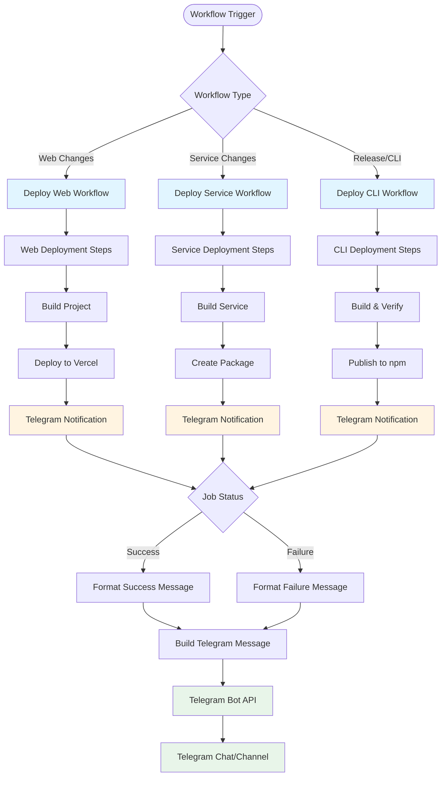
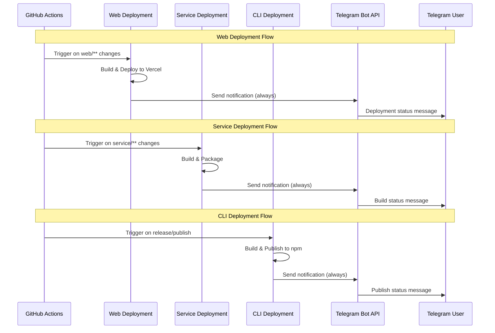

# Telegram Notifications Integration Plan

## Overview

Add Telegram bot notifications to all three GitHub Actions deployment workflows to provide real-time deployment status updates. The implementation will use direct cURL API calls (Option A) for simplicity and no external dependencies.

## Architecture Flow

The notification system will integrate into the existing workflow structure:



### Workflow Integration Points



## Implementation Details

### 1. Prerequisites Setup

**Required GitHub Secrets:**

- `TELEGRAM_BOT_TOKEN`: Bot token from @BotFather
- `TELEGRAM_CHAT_ID`: Channel/group chat ID (obtain via @userinfobot)

**Setup Steps:**

1. Create Telegram bot via @BotFather
2. Get chat ID using @userinfobot
3. Add secrets to GitHub repository settings

### 2. Workflow Modifications

#### 2.1 deploy-web.yml

**Location:** After line 79 (after "Deploy Project to Vercel" step)

**Implementation:**

- Add Telegram notification step with `if: always()` condition
- Include deployment status, URL, version, branch, actor, and workflow link
- Format message with HTML for better readability
- Use deployment URL from `steps.vercel-deploy.outputs.url`
- Use version from `steps.package-version.outputs.version`

**Message Content:**

- Status emoji (✅ for success, ❌ for failure)
- Repository name
- Branch name
- Version (for success)
- Deployment URL (for success)
- Actor (who triggered)
- Workflow run link

#### 2.2 deploy-service.yml

**Location:** After line 51 (after "Upload deployment package" step)

**Implementation:**

- Add Telegram notification step with `if: always()` condition
- Include deployment status, branch, commit SHA, actor, and workflow link
- Since service deployment has multiple options (commented), notification will indicate build completion status
- Message will be simpler than web deployment (no version/URL extraction needed)

**Message Content:**

- Status emoji
- Repository name
- Branch name
- Commit SHA
- Actor
- Workflow run link

#### 2.3 deploy-cli.yml

**Location:** After line 49 (after "Publish to npm" step)

**Implementation:**

- Add Telegram notification step with `if: always()` condition
- Include publish status, version, actor, and workflow link
- Extract version from package.json or release tag
- Include npm package link if published successfully

**Message Content:**

- Status emoji
- Repository name
- Version published
- Actor
- npm package link (for success)
- Workflow run link

### 3. Notification Step Template

Each workflow will use a similar step structure:

```yaml
- name: Notify Telegram
  if: always()
  run: |
    STATUS="${{ job.status == 'success' && '✅ Deployed' || '❌ Failed' }}"
    curl -s -X POST "https://api.telegram.org/bot${{ secrets.TELEGRAM_BOT_TOKEN }}/sendMessage" \
      -d chat_id="${{ secrets.TELEGRAM_CHAT_ID }}" \
      -d parse_mode="HTML" \
      -d text="<b>${STATUS}</b>%0A📦 Repo: ${{ github.repository }}%0A🌿 Branch: ${{ github.ref_name }}%0A👤 By: ${{ github.actor }}%0A🔗 <a href='${{ github.server_url }}/${{ github.repository }}/actions/runs/${{ github.run_id }}'>View Run</a>"
```

### 4. Message Formatting

**HTML Formatting:**

- Use `<b>` tags for bold text
- Use `%0A` for line breaks in URL-encoded text
- Use `<a href='...'>` for clickable links
- Include emojis for visual clarity

**URL Encoding:**

- All special characters in message text must be URL-encoded
- Line breaks: `%0A`
- Spaces: `%20` or `+`
- Special characters: percent-encoded

### 5. Error Handling

- Use `if: always()` to ensure notifications are sent even if deployment fails
- Use `-s` flag with curl to suppress progress output
- Notification step failure won't fail the entire workflow (non-blocking)

## Files to Modify

1. [.github/workflows/deploy-web.yml](.github/workflows/deploy-web.yml) - Add notification after Vercel deployment
2. [.github/workflows/deploy-service.yml](.github/workflows/deploy-service.yml) - Add notification after package upload
3. [.github/workflows/deploy-cli.yml](.github/workflows/deploy-cli.yml) - Add notification after npm publish

## Testing Strategy

1. Test with manual workflow dispatch
2. Verify success notification format
3. Verify failure notification format (intentionally fail a step)
4. Confirm Telegram message formatting renders correctly
5. Verify links are clickable and functional

## Benefits

- Real-time deployment notifications
- No external action dependencies
- Lightweight implementation
- Works alongside existing Slack notifications
- Consistent notification pattern across all workflows